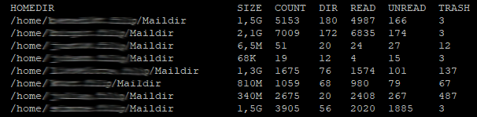

# maildir-stats
Useful statistical output of Maildir user mailboxes 

Getting an overview of the usage of user mailboxes can be useful for many purposes 

- Resource planning and trend analysis 
- Introducing quotas 
- Planning and completeness checks for migrations 

to name but a few. 



I created this script to migrate a Dovecot dsync cluster node for validation after replication.

## FEATURES 

As of today, the script creates a table of existing mailboxes in the stdout as followed:

- Total size of the mailbox with all subdirectories
- Total number of messages 
- Number of subdirectories within the mailbox
- Number of read e-mails
- Number of unread e-mails
- Number of deleted emails in the recycle bin

## INSTALLATION

Change to the directory you would like to install the script e.g. your root home directory ```cd ~```

Download the maildir-stats script from Git repository
```
git clone https://github.com/filipnet/maildir-stats.git
```
Give the script execution permissions
```
cd maildir-stats 
chmod +x maildir-stats.sh
```
## LICENSE

maildir-stats and all individual scripts are under the BSD 3-Clause license unless explicitly noted otherwise. Please refer to the LICENSE.
